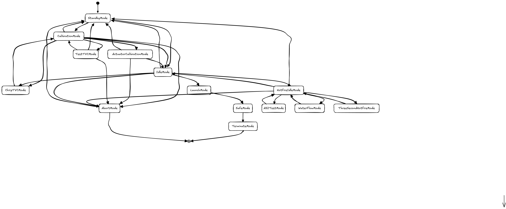

# Table of Contents
1. [Introduction](#introduction)
   - [Mode.cpp](#modecpp)
   - [Navigation.cpp](#navigationcpp)
   - [Controller.cpp](#controllercpp)
   - [LaunchManager.cpp](#launchmanagercpp)
   - [Telemetry.cpp](#telemetrycpp)

## Introduction 
These are all of our non-hardware files.
### Mode.cpp
 
#### Summary
This is the brain of our Flight Software.
`Mode::Update()` is the key method where we determine what Mode method to call based on what Mode we are in.
We either change modes based on an RF command, a navigation condition, or a timing condition.
Whenever we do change modes, it is important that we use `Telemetry::GetInstance().Log()` so that we know we switched correctly.

#### How to Add More Modes
1. Go to `Mode.hpp` in the include/ directory
2. Add to the enum `Phase`
3. Under `private:`, add the new method for your mode following the naming convention of `Update...()`
4. Go back to `Mode.cpp` and implement the method
5. Add your Mode enum to the switch statement in `Update()`

#### Current Flow Diagram Implementation

### Navigation.cpp
This class is in charge of estimating the rocket's current state. The state vector is 16 values:
position, velocity, quaternion attitude, accelerometer bias, and gyro bias.

`UpdateNavigation()` is the main method. First, it propagates the state forward using the IMU acceleration and angular rate. Then it updates the covariance matrix and corrects the estimate with whatever sensors have fresh data.

The current correction sources are:
1. Magnetometer, which corrects attitude by comparing the measured magnetic field to `MissionConstants::kEarthMagField`
2. GPS position and GPS velocity, which correct position and horizontal velocity when the GPS has fresh data
3. Camera, which requests captures on a fixed period and uses marker unit vectors to correct position and attitude
4. Lidar, which corrects altitude near the ground
5. Pad updates, which act like zero-velocity and zero-angular-velocity updates while the rocket is still on the pad

All correction sensors including Magnometer, GPS position, GPS velocity, Camera, and Lidar (The turning on and off modes in Mode are not implemented because Lidar is
not set up yet) are off by default in Debug and Release mode and on in Simulation mode

The shared correction method is `kalmanUpdate()`. Each sensor-specific update builds its measurement matrix `H`, measurement noise `V`, measured value `y`, and predicted value `y_pred`, then calls `kalmanUpdate()` to inject the error state back into position, velocity, attitude, and bias estimates.

NOTE:
The camera update uses the Hungarian algorithm to match detected marker directions to expected marker directions from `MissionConstants::kMarkerData`. If the camera debug frame setting is on, Navigation also asks the Camera class to save images showing expected markers and matched detections.

Navigation also tracks mass properties during flight. `UpdateMassFractionEstimate()` uses the current thrust command to estimate mass flow, then `UpdateMassPropertyEstimates()` interpolates between dry and wet center of mass and moment of inertia values from `MissionConstants`.

### Controller.cpp
This class is in charge of turning navigation estimates into engine, TVC, and RCS commands.

`UpdateLaunch()` is the main launch controller method. It gets the current state from `Navigation`, then runs:
1. `RcsControl()` to compute the yaw/RCS command
2. `TranslationControl()` to compute roll and pitch setpoint angles from x/y position and velocity errors
3. `AttitudeControl()` to point the rocket at those setpoint angles using the TVC
4. `HeightControl()` to compute the thrust command from altitude and vertical velocity errors

`AttitudeControl()` builds the attitude error from the current quaternion, integrates that error, compares the setpoint angle rate to the measured angular velocity, and stores those values in `x_control`. Then `CalculateInput()` applies the angle controller gains and scales the command using the estimated moment of inertia, center of mass, thrust level, and engine thrust location. The final TVC command is clamped to `MissionConstants::kMaximumTvcAngle`.

`HeightControl()` uses the height controller gains to calculate a vertical acceleration command, adds gravity, converts that to thrust using the estimated mass, and clamps the result between `kEngineMinThrust` and `kEngineMaxThrust`.

`ImportAngleParameters()`, `ImportHeightParameters()`, and `ImportTranslationParameters()` load controller gain matrices from CSV files. The files must have the expected number of rows and columns or the method will throw an error.

NOTE:
`RcsControl()` currently calculates a command based on yaw and yaw rate deadbands, but the hardware interface for actually firing RCS thrusters is still a TODO.

### LaunchManager.cpp
This class is in charge of the launch guidance state machine. It keeps track of the current launch phase and updates the reference altitude, velocity, and acceleration values that `Controller.cpp` follows.

The launch phases are:
1. `Takeoff`
2. `Ascend`
3. `Hover`
4. `Descend`
5. `Land`

`Ascend` and `Descend` each use a smaller `ChangeAltitudePhase` state machine:
1. `Accelerate`
2. `ConstantVelocity`
3. `Decelerate`

`Step()` is the main method. Every time it runs, it updates Navigation, checks for abort commands, reads the current altitude and vertical velocity, estimates the current max acceleration and deceleration from mass and thrust limits, and then advances the launch phase when the altitude, velocity, or timing condition is met.

The abort commands are handled near the top of `Step()`:
1. `ABORT_PAD` transitions directly to `Descend`
2. `ABORT_GROUND` transitions directly to `Descend` and also calls `controller.ZeroTranslationalSetpointAngles()`

At the end of `Step()`, the reference altitude is integrated from the current reference velocity, `controller.UpdateLaunch()` is called, and Navigation updates its mass estimate using the current thrust command. When landing is complete, `Step()` calls `controller.UpdateSafe()` and returns `true` so the top-level mode logic can transition to Safe mode.

### Telemetry.cpp
This class is in charge of writing all of our data to log files and sending our data to ground control through RF communication with XBees.

We call `RunTelemetry()` before executing the current Mode method.
In `RunTelemetry()`, we use `HardwareSaveDelta`, which controls how often we write to our log files, and `RFSaveDelta`, which controls how often we send data through RF. `gps_update_count` is not an argument but instead a local static variable that is used to control how often we write to the GPS log file.

NOTE:
We use the JSON data type to send data through RF, and we always append a newline because the RF.py class in ground control expects a newline when looking through the buffer.
